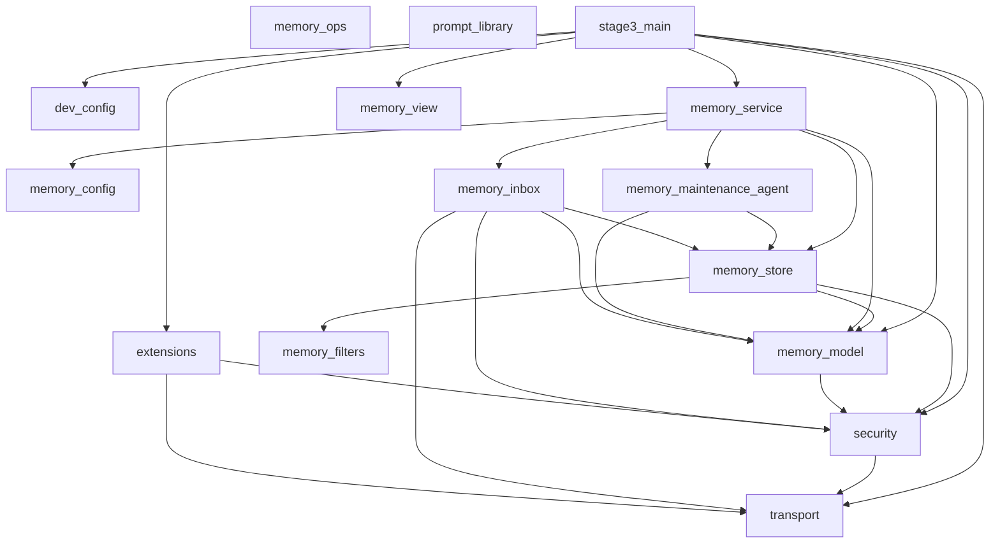
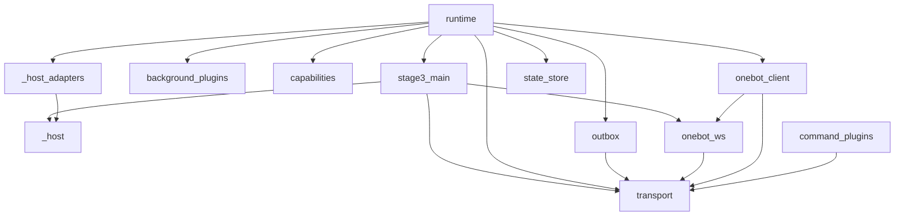
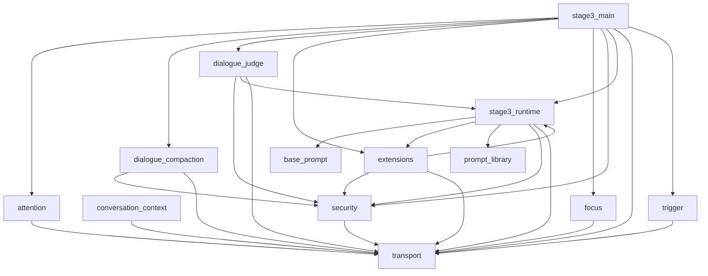
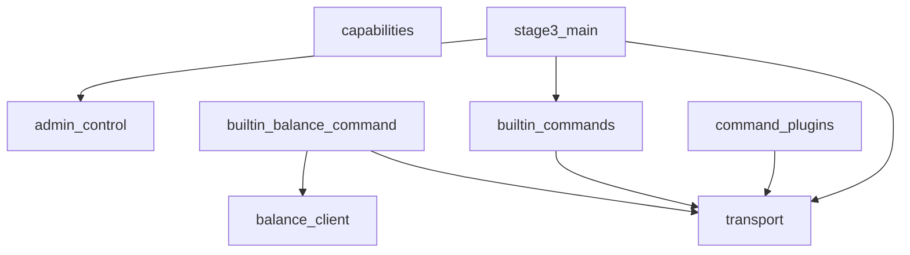
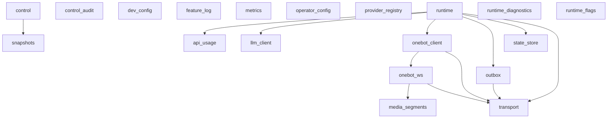
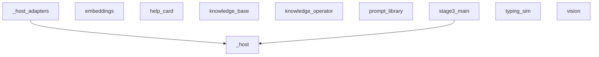
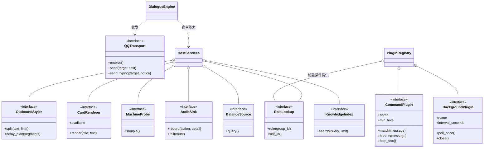
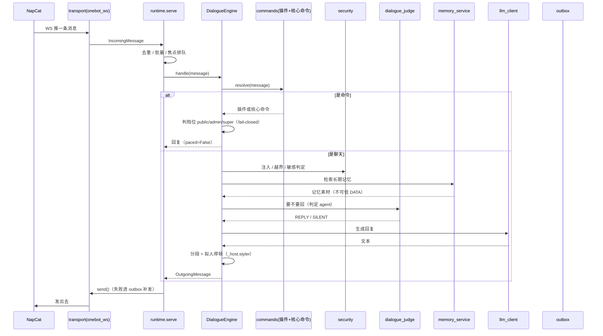

# 结构图（Mermaid，随代码重新生成）

> 生成命令：`.\\.venv\\Scripts\\python.exe data\\tmp_mermaid.py`
> 节点与边都是从代码里读出来的，**不是手画的**——所以图不会和代码撒谎。
>
> 约定：**实线 `-->` = 顶层 import**（模块一加载就依赖，删掉就起不来）。
> **函数内 import**（可插：删掉只是少一项能力）**不画线**，每个图后面用表格列出——
> 虚线一多，图会绕成一团乱麻，反而看不清主干。
> 颜色：蓝=底层，绿=Stage 3，橙=宿主/可插。

## 一、主干调用链（谁调谁）

```mermaid
flowchart TD
    n__host["_host"]
    n__host_adapters["_host_adapters"]
    n_attention["attention"]
    n_background_plugins["background_plugins"]
    n_capabilities["capabilities"]
    n_command_plugins["command_plugins"]
    n_conversation_context["conversation_context"]
    n_dev_config["dev_config"]
    n_dialogue_compaction["dialogue_compaction"]
    n_dialogue_judge["dialogue_judge"]
    n_extensions["extensions"]
    n_focus["focus"]
    n_llm_client["llm_client"]
    n_memory_maintenance_agent["memory_maintenance_agent"]
    n_memory_model["memory_model"]
    n_memory_service["memory_service"]
    n_memory_store["memory_store"]
    n_onebot_ws["onebot_ws"]
    n_outbox["outbox"]
    n_prompt_library["prompt_library"]
    n_runtime["runtime"]
    n_security["security"]
    n_stage3_main["stage3_main"]
    n_stage3_runtime["stage3_runtime"]
    n_state_store["state_store"]
    n_transport["transport"]
    n_trigger["trigger"]

    n__host_adapters --> n__host
    n_attention --> n_transport
    n_command_plugins --> n_transport
    n_conversation_context --> n_capabilities
    n_conversation_context --> n_transport
    n_dialogue_compaction --> n_security
    n_dialogue_compaction --> n_transport
    n_dialogue_judge --> n_security
    n_dialogue_judge --> n_stage3_runtime
    n_dialogue_judge --> n_transport
    n_extensions --> n_security
    n_extensions --> n_stage3_runtime
    n_extensions --> n_transport
    n_focus --> n_transport
    n_memory_maintenance_agent --> n_memory_model
    n_memory_maintenance_agent --> n_memory_store
    n_memory_model --> n_security
    n_memory_service --> n_memory_maintenance_agent
    n_memory_service --> n_memory_model
    n_memory_service --> n_memory_store
    n_memory_store --> n_memory_model
    n_memory_store --> n_security
    n_onebot_ws --> n_transport
    n_outbox --> n_transport
    n_runtime --> n__host_adapters
    n_runtime --> n_background_plugins
    n_runtime --> n_capabilities
    n_runtime --> n_conversation_context
    n_runtime --> n_extensions
    n_runtime --> n_llm_client
    n_runtime --> n_memory_service
    n_runtime --> n_outbox
    n_runtime --> n_stage3_main
    n_runtime --> n_state_store
    n_runtime --> n_transport
    n_security --> n_transport
    n_stage3_main --> n__host
    n_stage3_main --> n_attention
    n_stage3_main --> n_dev_config
    n_stage3_main --> n_dialogue_compaction
    n_stage3_main --> n_dialogue_judge
    n_stage3_main --> n_extensions
    n_stage3_main --> n_focus
    n_stage3_main --> n_llm_client
    n_stage3_main --> n_memory_model
    n_stage3_main --> n_memory_service
    n_stage3_main --> n_onebot_ws
    n_stage3_main --> n_security
    n_stage3_main --> n_stage3_runtime
    n_stage3_main --> n_transport
    n_stage3_main --> n_trigger
    n_stage3_runtime --> n_extensions
    n_stage3_runtime --> n_memory_model
    n_stage3_runtime --> n_prompt_library
    n_stage3_runtime --> n_security
    n_stage3_runtime --> n_transport
    n_trigger --> n_transport

classDef bottom fill:#dbe9f8,stroke:#1f5691,color:#123
classDef stage3 fill:#def2de,stroke:#246a34,color:#132
classDef host fill:#fce9d2,stroke:#96540f,color:#321
```



| 模块 | 函数内 import（可插：删掉只是少一项能力） |
| --- | --- |
| `dialogue_judge` | `prompt_library` |
| `memory_maintenance_agent` | `prompt_library` |
| `prompt_library` | `dialogue_judge`, `memory_maintenance_agent`, `stage3_runtime` |
| `stage3_main` | `_host_adapters`, `capabilities`, `command_plugins`, `runtime` |

## 二、记忆子系统



| 模块 | 函数内 import（可插：删掉只是少一项能力） |
| --- | --- |
| `memory_maintenance_agent` | `prompt_library` |
| `memory_store` | `memory_config` |
| `prompt_library` | `memory_maintenance_agent` |

## 三、按功能的分解图

## 入口与装配（谁把东西接起来）



| 模块 | 函数内 import（可插：删掉只是少一项能力） |
| --- | --- |
| `stage3_main` | `_host_adapters`, `capabilities`, `command_plugins`, `runtime` |

## 对话：判定、压缩、注意力、人格



| 模块 | 函数内 import（可插：删掉只是少一项能力） |
| --- | --- |
| `dialogue_judge` | `prompt_library` |
| `prompt_library` | `base_prompt`, `dialogue_judge`, `stage3_runtime` |

## 命令：/admin、公开命令、动作执行



| 模块 | 函数内 import（可插：删掉只是少一项能力） |
| --- | --- |
| `builtin_commands` | `builtin_balance_command`, `command_plugins` |
| `stage3_main` | `balance_client`, `builtin_balance_command`, `capabilities`, `command_plugins` |

## 底层：传输、模型、配置、状态、日志



| 模块 | 函数内 import（可插：删掉只是少一项能力） |
| --- | --- |
| `runtime` | `control_audit`, `provider_registry`, `group_roles` |

## 宿主与可插能力



| 模块 | 函数内 import（可插：删掉只是少一项能力） |
| --- | --- |
| `_host_adapters` | `help_card`, `typing_sim` |
| `knowledge_operator` | `knowledge_base` |
| `prompt_library` | `vision` |
| `stage3_main` | `_host_adapters`, `help_card`, `vision` |
| `vision` | `prompt_library` |

## 四、四个契约（接口）



## 五、一条消息的路径（时序）



---

## 渲染好的图（PNG）

九张图都在 [`docs/graph/`](graph/)。**按功能拆开**，每张 8~27 个节点——整张 59 节点的图会被
mermaid 排成一大排（实测 1784x236），每个框只剩十几像素宽，没法看。

| 图 | 文件 | 规模 |
| --- | --- | --- |
| 主干调用链 | [`spine.png`](graph/spine.png) | 27 节点 / 57 边 |
| 记忆子系统 | [`memory.png`](graph/memory.png) | 15 节点 / 25 边 |
| 入口与装配 | [`entry.png`](graph/entry.png) | 12 节点 / 17 边 |
| 对话（判定/压缩/注意力/人格） | [`dialogue.png`](graph/dialogue.png) | 13 节点 / 27 边 |
| 命令（/admin、公开命令、动作执行） | [`commands.png`](graph/commands.png) | 8 节点 / 7 边 |
| 底层（传输/模型/配置/状态/日志） | [`bottom.png`](graph/bottom.png) | 19 节点 / 12 边 |
| 宿主与可插能力 | [`hostcap.png`](graph/hostcap.png) | 11 节点 |
| 四个契约与接口 | [`interfaces.png`](graph/interfaces.png) | classDiagram |
| 一条消息的路径 | [`sequence.png`](graph/sequence.png) | sequenceDiagram |

> SVG 里文字是 `<foreignObject>`（HTML 文本），很多查看器不画它，打开是"有框没字"，
> 所以这里用 PNG。要矢量图自己渲染：`npx --yes @mermaid-js/mermaid-cli@11 -i x.mmd -o x.svg`。

重渲染（改完代码跑这两条，图和代码就不会分家）：

```powershell
.\\.venv\\Scripts\\python.exe data\\tmp_mermaid.py        # 重新生成 docs/GRAPH.md
# 每个 mermaid 块导出成 .mmd 后：
npx --yes @mermaid-js/mermaid-cli@11 -i x.mmd -o docs/graph/x.png -b white -s 3
```
